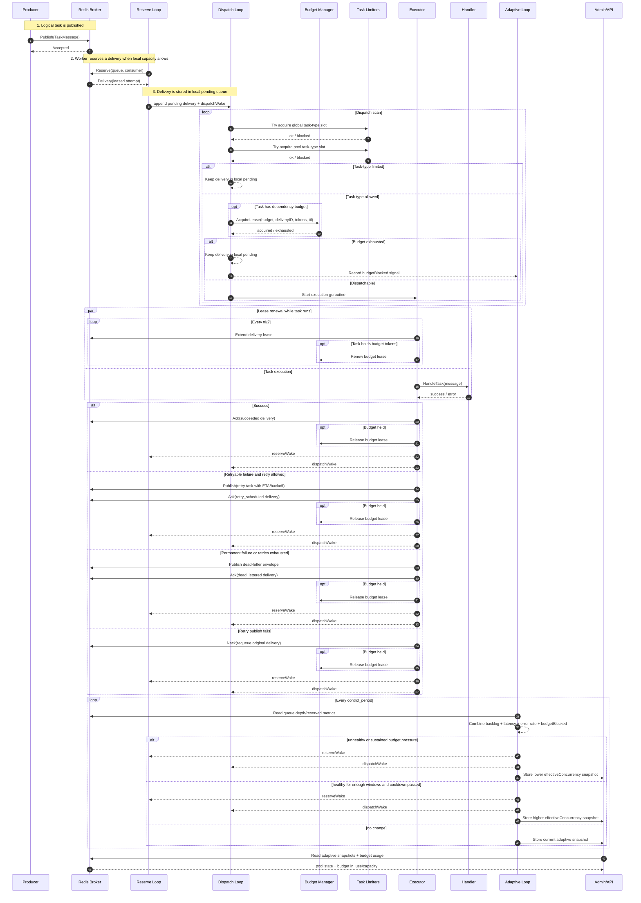

# Phase 12 Sequence Diagram

Open this file in any Markdown preview that supports Mermaid, or paste the block into https://mermaid.live.

```mermaid
sequenceDiagram
    autonumber

    participant P as Producer
    participant R as Redis Broker
    participant RL as Reserve Loop
    participant DL as Dispatch Loop
    participant BM as Budget Manager
    participant TL as Task Limiters
    participant EX as Executor
    participant H as Handler
    participant AS as Adaptive Loop
    participant API as Admin/API

    Note over P,R: 1. Logical task is published
    P->>R: Publish(TaskMessage)
    R-->>P: Accepted

    Note over RL,R: 2. Worker reserves a delivery when local capacity allows
    RL->>R: Reserve(queue, consumer)
    R-->>RL: Delivery(leased attempt)

    Note over RL,DL: 3. Delivery is stored in local pending queue
    RL->>DL: append pending delivery + dispatchWake

    loop Dispatch scan
        DL->>TL: Try acquire global task-type slot
        TL-->>DL: ok / blocked
        DL->>TL: Try acquire pool task-type slot
        TL-->>DL: ok / blocked

        alt Task-type limited
            DL-->>DL: Keep delivery in local pending
        else Task-type allowed
            opt Task has dependency budget
                DL->>BM: AcquireLease(budget, deliveryID, tokens, ttl)
                BM-->>DL: acquired / exhausted
            end

            alt Budget exhausted
                DL-->>DL: Keep delivery in local pending
                DL-->>AS: Record budgetBlocked signal
            else Dispatchable
                DL->>EX: Start execution goroutine
            end
        end
    end

    par Lease renewal while task runs
        loop Every ttl/2
            EX->>R: Extend delivery lease
            opt Task holds budget tokens
                EX->>BM: Renew budget lease
            end
        end
    and Task execution
        EX->>H: HandleTask(message)
        H-->>EX: success / error
    end

    alt Success
        EX->>R: Ack(succeeded delivery)
        opt Budget held
            EX->>BM: Release budget lease
        end
        EX-->>RL: reserveWake
        EX-->>DL: dispatchWake
    else Retryable failure and retry allowed
        EX->>R: Publish(retry task with ETA/backoff)
        EX->>R: Ack(retry_scheduled delivery)
        opt Budget held
            EX->>BM: Release budget lease
        end
        EX-->>RL: reserveWake
        EX-->>DL: dispatchWake
    else Permanent failure or retries exhausted
        EX->>R: Publish dead-letter envelope
        EX->>R: Ack(dead_lettered delivery)
        opt Budget held
            EX->>BM: Release budget lease
        end
        EX-->>RL: reserveWake
        EX-->>DL: dispatchWake
    else Retry publish fails
        EX->>R: Nack(requeue original delivery)
        opt Budget held
            EX->>BM: Release budget lease
        end
        EX-->>RL: reserveWake
        EX-->>DL: dispatchWake
    end

    loop Every control_period
        AS->>R: Read queue depth/reserved metrics
        AS-->>AS: Combine backlog + latency + error rate + budgetBlocked
        alt unhealthy or sustained budget pressure
            AS-->>RL: reserveWake
            AS-->>DL: dispatchWake
            AS->>API: Store lower effectiveConcurrency snapshot
        else healthy for enough windows and cooldown passed
            AS-->>RL: reserveWake
            AS-->>DL: dispatchWake
            AS->>API: Store higher effectiveConcurrency snapshot
        else no change
            AS->>API: Store current adaptive snapshot
        end
    end

    API->>R: Read adaptive snapshots + budget usage
    R-->>API: pool state + budget in_use/capacity
```
