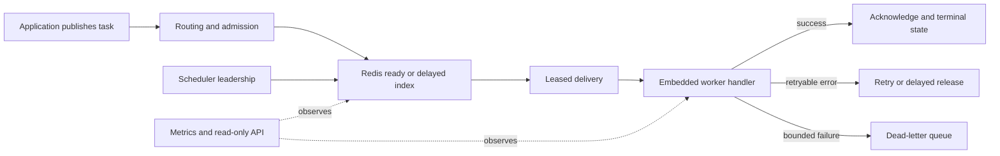

# TaskForge: a Redis task runtime that stays understandable under pressure

Background jobs become difficult when several kinds of pressure arrive together. One customer can fill a shared queue. A retry storm can multiply work. A downstream service can fail when too many handlers call it at once. A worker can disappear while Redis still believes it owns a delivery. A scheduler can lose leadership while delayed work becomes due.

[TaskForge](https://github.com/Aminkbi/taskForge) is a Go runtime for those conditions. It combines an embeddable worker, a Redis Streams broker, optional scheduler and read-only API sidecars, and overload controls behind one set of contracts.

The design starts with a clear delivery rule: execution is at least once. A task can run more than once, so handlers must be idempotent. Redis can reclaim an expired lease and another worker can retry the task, but the runtime does not promise exactly-once execution.

## The API stays small

A task is data plus a name. Applications register the code that handles that name, then embed the worker in their own process:

```go
cfg := taskforge.Config{
    WorkerPools: []taskforge.WorkerPoolConfig{{
        Name: "default", Queue: "default", Concurrency: 4,
        TaskTimeout: 30 * time.Second,
    }},
}

broker, err := taskforgeredis.OpenFromConfig(ctx, cfg, taskforgeredis.Options{
    Addr: "localhost:6379",
})
if err != nil {
    return err
}
defer broker.Close()

task := taskforge.NewTask(
    "email.send",
    []byte(`{"to":"user@example.com"}`),
    taskforge.WithQueue("default"),
    taskforge.WithIdempotencyKey("email:user@example.com:welcome"),
)
if _, err := broker.Publish(ctx, task, taskforge.PublishOptions{}); err != nil {
    return err
}

registry := taskforge.NewRegistry()
_ = registry.RegisterFunc("email.send", func(ctx context.Context, task taskforge.Task) error {
    // Decode task.Payload and perform an idempotent side effect.
    return nil
})

runtime, err := worker.NewFromConfig(cfg, "default", worker.Options{
    Broker: broker, Handler: registry,
})
if err != nil {
    return err
}
return runtime.Run(ctx)
```

There is no generic worker binary. The application owns handler registration, idempotency, and the process lifecycle.

## How a task moves



A task ID names logical work. A stream entry and delivery ID name one broker attempt. A lease owner names the worker allowed to acknowledge, retry, extend, or dead-letter that attempt. A stale owner cannot modify a newer delivery.

New work is routed once. Retries, delayed releases, recurring work, requeues, and dead-letter flows preserve that placement. A dead-letter publish must succeed before the source delivery is acknowledged, so a failed handoff remains recoverable.

The scheduler is optional. Its writes carry a leadership fence, which prevents a former leader from releasing work after a newer leader has taken over. The API sidecar is read-only and exposes operational state rather than becoming a second task-processing plane.

## Protecting tenants and dependencies

TaskForge combines four controls:

- weighted fairness separates entitlement from offered load;
- admission can reject or defer work when queue, tenant, retry, or age signals exceed policy;
- dependency budgets lease tokens while a handler uses a named downstream resource; and
- adaptive concurrency changes the worker window from observed latency, errors, backlog, and starvation signals.

Metrics expose queue depth, reservations, tenant service, SLO attainment, controller actions, dependency over-capacity, retries, and dead-letter growth. Operators can see whether pressure is in a queue, tenant policy, worker, dependency, or Redis.

## What the completed benchmark found

The control-plane study compared a clean parent with an optimized revision using the same benchmark harness, a dedicated standalone Redis process, 30 operations per sample, and ten repetitions. It measured publish paths, queue snapshots across one, 16, and 64 tenants, payloads from 256 bytes to 64 KiB, and setup/key hot paths. The raw logs and derived table are published in the [research package](https://github.com/Aminkbi/taskForge/tree/main/research/third-wave/data/final).

| Case | Before | After | Paired change |
| --- | ---: | ---: | ---: |
| Fair publish without a receipt | 153.6 µs | 100.6 µs | −34.8% |
| Publish throughput | 99.7 µs | 98.5 µs | +0.5%, inconclusive |
| Metrics snapshot, 64 tenants and 64 KiB payload | 43.3 ms | 0.510 ms | −98.8% |
| Key construction hot path | 698.5 ns | 286.2 ns | −57.8% |

The largest snapshot gains came from reading stream depth, pending counts, and consumer data through one pipeline instead of repeatedly walking the same state. Fair publish gained from recording the ready entry and built-in queued state in one Redis script. Successful consumer-group setup is cached, while failed setup is retried rather than cached. Hot key construction avoids formatting work.

These are host-local control-plane measurements. They do not predict remote-cloud latency, multi-host contention, application handler time, or a universal throughput ranking. The publish-throughput result was effectively unchanged, which is useful: the optimization targets control-plane work rather than claiming that every workload becomes faster.

Correctness gates passed for duplicate publish, queued-state visibility, stale lease fencing, retry and dead-letter behavior, worker handling, and Redis integration. A faster benchmark with a failed invariant would have been a regression; none of the measured comparisons crossed the study's 15% regression guard.

## Operating boundary

TaskForge currently supports a direct standalone Redis primary. Redis Cluster and Sentinel are rejected during validation. Delivery remains at least once, and handlers must be idempotent. Those constraints are deliberate because they keep failure handling and ownership behavior testable.

The full [reliability contract](https://github.com/Aminkbi/taskForge/blob/main/docs/reference/reliability.md), [benchmark method](https://github.com/Aminkbi/taskForge/blob/main/docs/operations/benchmarks.md), [raw measurements](https://github.com/Aminkbi/taskForge/tree/main/research/third-wave/data/final), and [derived analysis](https://github.com/Aminkbi/taskForge/blob/main/research/third-wave/results/analysis.md) are available in the repository. Start with the [README](https://github.com/Aminkbi/taskForge#readme) for the local demo and public API.
