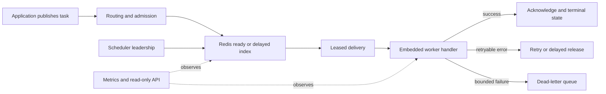

# TaskForge: building a Redis task runtime that stays understandable under pressure

Background jobs look simple until several kinds of pressure arrive together.
One customer can fill a shared queue. A retry storm can multiply the work. A
downstream service can fail when too many handlers call it at once. A worker can
disappear while Redis still believes it owns a delivery. A scheduler can lose
leadership while delayed work is becoming due.

TaskForge is a Go runtime for those conditions. It puts an embeddable worker,
a Redis Streams broker, optional scheduler and read-only API sidecars, and an
overload-control layer behind one set of contracts. The project has been built
with an explicit rule: every reliability promise names an executable check,
and every performance result names its workload, machine, and limits.

This article explains the whole project from the beginning. You do not need to
know the earlier research studies or what “wave 3” means.

## The problem TaskForge solves

A queue has two jobs. It must preserve work when processes pause or fail, and it
must decide which work gets scarce execution capacity. Basic queue libraries
usually handle the first job well enough for a single tenant. The second job
becomes difficult when tenants share workers and dependencies.

TaskForge chooses at-least-once delivery. A task may run more than once, so the
application handler must be idempotent. That choice keeps recovery possible:
Redis can reclaim an expired lease and another worker can try the task. The
runtime never promises exactly-once execution, because an external side effect
can happen immediately before a process or network failure.

The important identities are separate. A task ID names logical work. A stream
entry and delivery ID name one broker attempt. A lease owner names the worker
allowed to acknowledge, retry, extend, or dead-letter that attempt. A stale
owner cannot modify a newer delivery.

## How a task moves through the system



New work is routed once. Retries, delayed releases, recurring work, requeues,
and dead-letter flows preserve the established placement. A retry preserves the
logical task ID and is bounded by the delivery policy. Dead-letter publication
must succeed before the source delivery is acknowledged; if it does not, the
source remains recoverable.

The scheduler is a separate optional process. Its writes carry a leadership
fence, so a former leader cannot release work after a newer leader has taken
over. The API sidecar is read-only and exposes operational state rather than a
second task-processing control plane. Applications embed the worker because the
application owns handler registration and idempotency logic.

## What protects one tenant from another

TaskForge combines four controls. Weighted fairness separates entitlement from
offered load. Admission can reject or defer work when queue, tenant, retry, or
age signals exceed policy. Dependency budgets lease tokens while a handler uses
a named downstream resource. Adaptive concurrency changes the worker window
from observed latency, errors, backlog, and starvation signals.

These controls are observable. Metrics expose queue depth, reservations, tenant
service, SLO attainment, controller actions, dependency over-capacity, retries,
and dead-letter growth. Operators can tell whether pressure is in the queue, a
tenant policy, the worker, a dependency, or Redis itself.

## What the engineering work changed

The repository includes protocol simulations, bounded state-space model checks,
race tests, integration tests, release checks, and a public embedded-worker
demo. The Redis operating model is intentionally narrow: a direct standalone
Redis primary. Redis Cluster and Sentinel are rejected during validation rather
than being presented as partially supported topologies.

The latest committed optimization, `b2947f3`, targets the control plane rather
than handler code:

* ready publication records the built-in queued state in the same Redis script;
* queue metrics pipeline stream depth, pending count, and consumer reads;
* successful consumer-group setup is cached while failures are not;
* hot key construction avoids formatting overhead; and
* unprocessable delivery handling is bounded, with dead-letter size reported.

The checked benchmark notes report host-local before/after medians of 510 to
278 microseconds for fair publish without a receipt, 707 to 502 microseconds
with a receipt, and 8.80 to 0.89 milliseconds for a 64-tenant, 64-KiB metrics
case. Those are useful engineering observations. The raw paired logs are not
part of the committed evidence package, so this article does not turn them into
a general speedup claim.

## What the research actually measured

The first research artifact tested six workloads and seven variants: delayed
backlog, hot dependency, noisy neighbor, retry storm, tenant skew, and worker
crash, alongside TaskForge control ablations and a common-delivery Asynq arm.
It contains 504 registered records, 492 measurements, and 12 explicitly
unsupported fault cells. The analysis reports medians, seeded bootstrap
intervals, raw provenance, and a family-wise sensitivity analysis. It found
that overload controls trade metrics against one another; no single score was
used to declare a universal winner.

The follow-up study used immutable open-loop traces and paired arms in two
measured classes: direct loopback on a 12-logical-CPU host, and the same host
with four Go processors and a declared 1 ms round trip through a proxy. In the
native common-delivery sweep, TaskForge FIFO/static differed from Asynq by a
median 2.1 tasks/s. Under the emulated latency path, the median difference was
704.7 tasks/s. The contrast changed with environment, which is why these
numbers describe measured classes rather than “TaskForge is faster.”

The capability results were similarly conditional. Fairness effects were
strong under the constrained path, while a long-duration admission contrast
reversed sign between measured classes. Recovery cells that lacked an equivalent
process-kill fault in both adapters were retained as `not_measured`; they were
never converted to zeros.

## Why the new research is not yet a complete measured release

The method is ready. The treatment identity is immutable: baseline commit
`4446ab3`, optimization commit `b2947f3`, and a recorded binary diff digest.
The benchmark matrix, paired bootstrap, multiplicity rule, correctness gates,
and paper template are committed under [`research/third-wave/`](../).

The treatment result is not ready because two raw benchmark logs and their host
and Redis metadata are still missing. Redis was unavailable when the package
was prepared. Source inspection and a prose table cannot replace paired
observations. The historical first and second artifacts are complete; this
specific control-plane comparison is the remaining gap.

That distinction protects the reader. A benchmark result is publishable only
when the clean parent and optimized commit run with the same toolchain, Redis
topology, database isolation, fixed iteration count, and repetition schedule;
correctness tests must pass first. An interval crossing zero is inconclusive,
and a faster run with a failed invariant is a regression.

## Reproducing or extending the work

Start with the repository checks:

```bash
make test
make race-test
make simulation-test
make model-check
make docs-check
```

The committed research artifacts can be regenerated with `make research-check`
and `make second-wave-check`. For the new optimization treatment, run the same
Redis-backed benchmark command at `4446ab3` and `b2947f3`, retain the raw logs,
and compare them with:

```bash
make benchmark-regression \
  BENCHMARK_ARGS='/tmp/taskforge-wave3-baseline.txt /tmp/taskforge-wave3-treatment.txt'
```

`make third-wave-check` verifies the immutable treatment identity, research
module tests, evidence manifest, and documentation. The full research package
is under [`research/`](../../); the reliability contract and its executable
checks are in [`docs/reference/reliability.md`](../../../docs/reference/reliability.md).

TaskForge is therefore a runtime, a set of operational contracts, and a set of
measurements with visible limits. The project is not asking a benchmark to
prove a universal winner. It is showing which guarantee or control was tested,
what it cost on the measured system, and what evidence is still required before
the next claim is ready.
